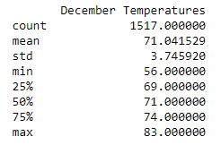
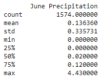
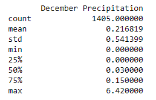

# Surf's Up
## Overview of the Statistical Analysis
In order to determine if a surf and ice cream shop business is sustainable year-round, the temperature data for the months of June and December in Oahu were collected and analyzed.  Oahu is third largest Hawaiian island, is home to roughly one million people and has over five million tourists visit it each year.  Given the large amount of people and the popularity of its beaches, if the weather is consistently good a store which deals in both surfing gear and ice cream has a good chance of succeeding.   In Hawaii, the climate is tropical, with a hot season from June to October (called kau in the Hawaiian language) and a relatively cool season (hooilo) from December to March.  The question the data will answer is how hot and how cool it gets in each of the seasons.      

## Results
Reviewing the temperature data, there are three key differences which will be highlighted.
* The median temperature is higher in June versus December.  Two tables with summary statistics for the months of June and December can be seen below.  The median June temperature (50%) is 75 °F while it is 71 °F for December.  Additionally, the maximum temperature is 85 °F and 83 °F for June and December, respectively.  Hence, one can expect warmer weather during the month of June versus December.   

* It is more likely for the temperature in December to be considered "chilly" than it is in June.  If one assumes that temperatures below 65 °F are considered chilly in a tropical climate, it is very unlikely that it will ever be chilly in the month of June given a minimum temperature of 64 °F and a 1st quartile temperature of 73°F.  It is much more likely for it be considered "chilly" in December with a minimum temperature of 56 °F and a 1st quartile temperature of 69°F.  

* The temperature is more consistent in June versus December.  Given a standard deviation of 3.75 °F in December versus 3.26 °F in June, one can expect more variable temperature ranges in December.  This can also be observed in the range of temperatures, which is 27 °F for December and only 11 °F for June.  

## Summary
While there are some differences in the temperature data from June and December, ultimately these differences are minor.  For example, there is only a 4 °F difference in the mean temperatures of 75 °F and 71 °F in June and December, respectively.  This same 4 °F can be found in the quartile statistics as well and suggest that during any time of the year the temperature is comfortable in Oahu.  The hottest temperature recorded 85 °F is not too hot and the chilliest temperature of 56 °F is not too chilly.    

Given that the temperature is expected to be comfortable year-round, the other weather factor that could impact a surf and ice cream shop is the precipitation.  Too much rain could lessen the chance of locals going out to surf or get ice cream.  In order to determine how much rain one can expect in a given month, the summary statistics for the precipitation for the months of June and December were generated and can be viewed in the tables below.    Given a 1st quartile value of 0 for both months and a median rainfall of 0.02 mm and 0.03 mm for June and December, respectively, it is clear that rain is not expected on any given day of the month.  However, given a max precipitation of 4.43 mm and 6.43 mm found in June and December, there is a significant amount of rainfall when it does rain.  Hence, it does not rain very often on Oahu, but when it does a large volume of rain falls in a short amount of time.  The relatively infrequent rainfall is a favorable condition for the surf and ice cream shop. 

In conclusion, the data shows favorable weather on any given day in Oahu.  Both the temperature and rainfall are favorable for people to spend lots of time outdoors on any given day of the month.  Hence, if locals and tourists enjoy either surfing and/or ice cream, the surf and ice cream shop has a good chance of success.  
 
