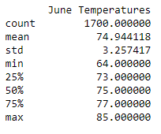

# Surf's Up
## Overview of the Statistical Analysis
  information about temperature trends before opening the surf shop. Specifically, he wants temperature data for the months of June and December in Oahu, in order to determine if the surf and ice cream shop business is sustainable year-round.

## Results
Reviewing the data there are three key differences..
* June temps...

* December temps...

 
* A third difference...

## Summary
Summary of above, pluse two additional queries

 
